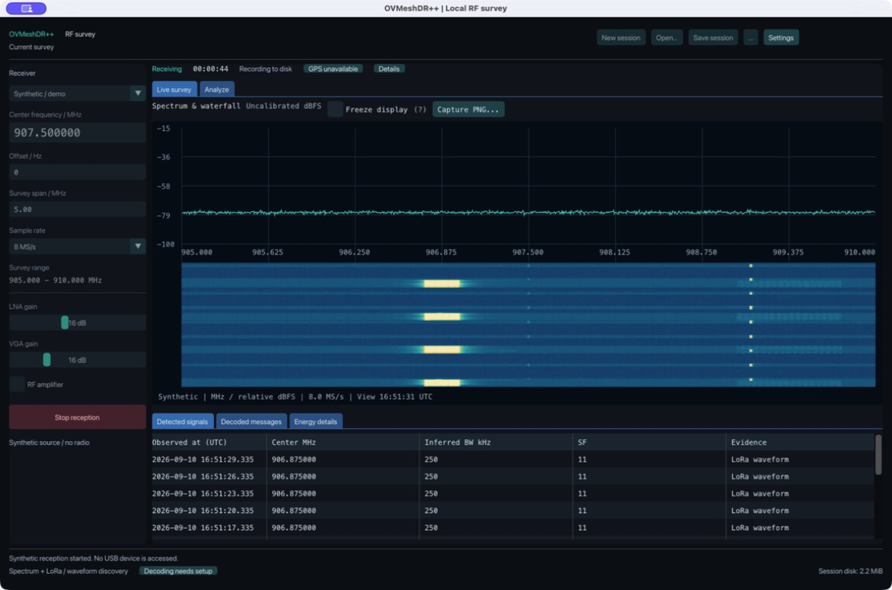
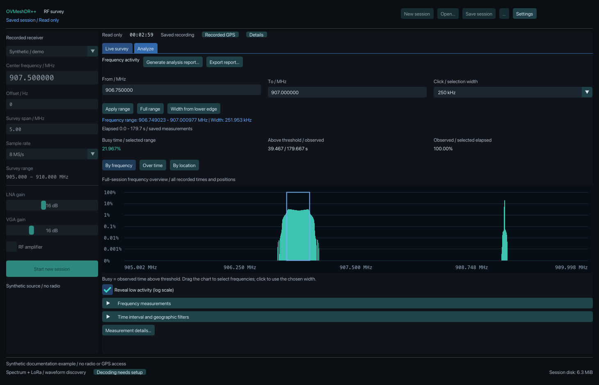
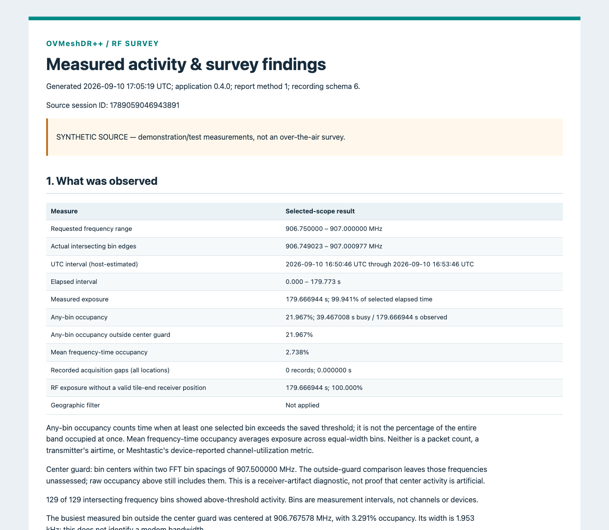

# OVMeshDR++

**Community & support:** Join the [OVMesh Discord](https://discord.gg/kwKhFamfaU).

**Hardware support:** **HackRF One is the recommended hardware for wider RF surveys.** Its direct USB receive adapter supports 8, 10, 12, 16 or 20 MS/s, with a configurable spectrum span of up to **16 MHz at 20 MS/s**. The default is **10 MHz at 16 MS/s**; full-width performance still requires validation. RTL-SDR also has direct USB reception and supports 1–2 MS/s, up to 1.6 MHz for spectrum surveying or 1.5 MHz for LoRa discovery at 2 MS/s. Experimental **RAK5146 USB/LBT** support adds one or two concentrators for sampled RF scans and configured LoRa reception on macOS and eligible Linux builds. RAK scans are sampled RSSI histograms, not an SDR waterfall or continuous band coverage. See [receiver and platform compatibility](docs/operations/hardware-compatibility.md), [RTL-SDR setup](docs/operations/rtl-sdr.md), and [concentrator measurements](docs/design/concentrator-measurements.md).

OVMeshDR++ is a local, receive-only spectrum survey application with an SDR++-inspired desktop interface. Observe a configurable frequency range, save measurements with optional receiver GPS, and explore activity by frequency, time and location. The application runs locally; it has no cloud service, automatic uploader or online map.

**Version 0.4.0 is experimental source.** Spectrum surveying is the primary workflow. LoRa waveform discovery and explicitly configured Meshtastic decoding are experimental; this version does not reliably identify every transmission or automatically decode discovered waveforms throughout the range. MeshCore decoding is not implemented yet. See [capabilities and limitations](docs/engineering/implementation-status.md).

## What you can do

- View the live spectrum and waterfall while recording a supplied usable range.
- Open a fresh session, save a copy, or deliberately open a previous survey.
- Record fine activity timing, coverage gaps, receiver settings and optional GPS associations in local SQLite sessions.
- Select arbitrary frequency intervals and compare busy time, observed duration, power and activity over time.
- Export compact frequency/time/location summaries, detailed archives, and a readable HTML analysis report with explicit privacy choices.
- Inspect inferred LoRa bandwidth and spreading factor separately from generic energy-event width.
- Configure authorized channel keys for selected Meshtastic profiles. No channel keys are installed automatically.
- Save a PNG of the visible spectrum/waterfall and view the current session's disk usage.
- Use one or two RAK5146 USB/LBT concentrators to collect sampled RSSI histograms and configured LoRa packet metadata, with separate recording and reporting semantics.

## Screenshots

These desktop examples use synthetic input. They illustrate the interface, not measured field performance.

### Sample analysis report

The report explains observation coverage, busy time, frequency activity and measurement limits for the selected scope. This example uses generated RF data and includes no actual receiver location. The [gallery](docs/screenshots/README.md) shows more screens and explains how to interpret them.

## Build and use

Start with the [build instructions](docs/operations/deployment.md) and [user guide](docs/user-guide.md). The synthetic receiver lets you explore the application without radio hardware. Ordinary startup opens an empty session with RF stopped; enabled recognized GPS setup may connect automatically. Saved receiver preferences persist, while old survey results and keys are not automatically restored.

**Building on Linux?** Follow the [Linux setup guide](docs/operations/linux-build.md). It prepares the required OpenSSL library inside the checkout without replacing system OpenSSL or requiring a Python virtual environment.

The core uses C++20/CMake, with a Dear ImGui/GLFW/OpenGL desktop, SQLite, bounded Nanopb decoding, OpenSSL libcrypto, and direct HackRF or RTL-SDR/libusb reception. RAK5146 uses a minimal pinned Semtech HAL subset in a separate local receive-only process. Dependencies are pinned and reviewed; normal builds do not download them. macOS development builds are available from source. Windows/Linux packaging and hardware behavior still require validation. The RAK worker requires macOS or Linux with safe child-process descriptor closure (glibc 2.34+); it is disabled on Windows.

## Understand the measurements

- **Occupancy** is above-threshold busy time divided by observed time over the same selected frequency/time scope. Unobserved time is not quiet time.
- **SDR power** is uncalibrated digital dBFS, not transmitter watts or antenna-port dBm. RAK reports uncalibrated vendor RSSI estimates in dBm; neither scale establishes transmitter power.
- **Waveform bandwidth** is inferred from compatible LoRa structure. Generic energy span and regulatory occupied bandwidth are different measurements.
- **Receiver GPS** locates the observation, not the transmitter. Fix quality and missing positions matter.
- A quiet-looking interval does not establish an interference-free channel or regulatory compliance.

The initial HackRF survey span is 10 MHz; selecting RTL-SDR sets 2 MS/s and a 1.5 MHz span. Remembered settings may differ. RAK scanning visits configured centers within 902–928 MHz sequentially; its sample-exceedance percentage is distinct from SDR busy time. Usable passband, sensitivity, mobile positioning, long-term capture reliability and protocol recall require further field validation. Read the [measurement reference](docs/design/spectrum-measurement-record.md), [concentrator measurement limits](docs/design/concentrator-measurements.md) and [RF capability gaps](docs/engineering/rf-survey-gap-analysis.md) before interpreting results.

## Privacy and security

Routine application recording stores approved RF measurements and eligible authorized decoded content. It has no raw-IQ, ciphertext or undecoded-payload storage field. Keys are configured in memory. Saved sessions can contain private locations, messages and notes, and are not encrypted at rest; a full session copy is not a redacted report. See [data handling](docs/design/data-model-and-retention.md) and [security/privacy](docs/security/security-and-privacy.md).

Use [private security reporting](SECURITY.md) for suspected disclosure or vulnerabilities. Do not attach real recordings, channel keys, node databases or precise routes to public issues.

## Documentation and contributions

[Documentation](docs/README.md) · [Roadmap](docs/product/roadmap.md) · [Architecture](docs/design/architecture.md) · [Validation](docs/engineering/quality-and-validation.md) · [Support](SUPPORT.md) · [Contributing](CONTRIBUTING.md)

The combined application uses GNU GPL version 3; original project code is GPL-3.0-or-later and third-party grants remain intact. See [LICENSE](LICENSE), [NOTICE](NOTICE), and [third-party credits](THIRD_PARTY_NOTICES.md). SDR++ inspired the interface, and selected SDRangel logic is credited in the source. This independent project is not affiliated with SDR++, SDRangel, Meshtastic or MeshCore.
