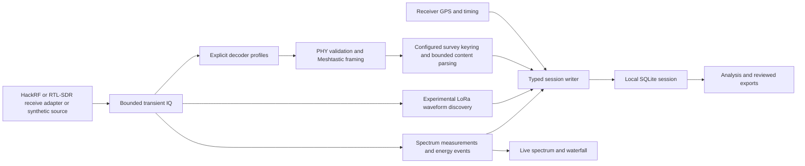

# Architecture

The application is a standalone C++20 receiver, measurement engine, local session store and native desktop interface. Dear ImGui, GLFW and OpenGL provide the UI; SQLite stores sessions; selected SDRangel-derived algorithms, OpenSSL libcrypto and Nanopb support the current LoRa/Meshtastic path. It does not require SDR++, SDRangel, GNU Radio or a mesh companion application at runtime. See [dependencies and licensing](../engineering/dependencies-and-licensing.md).

## Current processing paths

**Waveform discovery does not automatically feed the payload decoder.** Discovery searches for compatible LoRa preambles and infers frequency, bandwidth and spreading factor. Payload processing still requires explicit frequency/BW/SF profiles. Discovering and decoding compatible traffic anywhere in the supplied span remains an unfinished integration requirement. Unknown activity still contributes spectrum measurements.

## Component boundaries

| Component | Current responsibility | Important limit |
|---|---|---|
| Receive adapter and engine | Receive-only device access, transient sample ownership, configuration, sample progression and known acquisition gaps | No RF transmission or mesh administration; upstream missing-sample counts may be unknown |
| Spectrum processor | Complete accepted FFT intervals, frequency-resolved powers/activity masks, energy events and live display values | Uncalibrated dBFS; finite resolution and a fixed activity threshold |
| Waveform discovery | Shared channelization and bounded background processing for LoRa preamble/BW/SF observations | Separate queue/processing losses; no exhaustive detection or protocol identity guarantee |
| Profile decoders | Channel extraction, synchronization, symbol decoding and PHY checks for configured lanes | Weak-signal, clock/timing and CRC-performance gaps remain |
| Protocol and keys | Native Meshtastic wire handling, finite explicit survey keyring and bounded generated protobuf decoding | No implicit keys, MeshCore decoder, recipient PKI or authenticated channel-sender identity |
| Session writer | Allowlisted typed records, SQLite transactions and versioned recording formats | No opaque undecoded payload or raw-IQ field; session files are plaintext |
| GPS provider | Local device metadata, selected NMEA connection, fix validity and acquisition-time association | Receiver location only; a connection is not a valid fix or a measured accuracy guarantee |
| Desktop and reports | Live status, source-bound analysis, saved-session actions and local exports | Display bounds do not establish complete discovery or transmitter attribution |

## Concurrency and state

Spectrum processing and waveform discovery have separate bounded work paths. The discovery workers process transient complex samples and return bounded observations; they do not directly access SQLite, keys, GPS or UI state. Receiver positions attach using acquisition timing. Queue rejection, abandoned processing and acquisition gaps are recorded separately, so uninterrupted spectrum transport cannot be mistaken for uninterrupted discovery.

Native components share one process. Bounded buffers and checked parsing reduce exposure but do not isolate a faulty library from the application process. See [security and privacy](../security/security-and-privacy.md).

Receiver configuration changes require stopping reception and starting a new session. Multiple mutable configuration epochs within one saved session are not implemented. Key changes use a stop/drain/clear boundary; there is no asynchronous key-policy service or persistent key vault. Ordinary startup creates a fresh workspace with RF stopped; an enabled recognized or remembered GPS may connect automatically. Demo, historical and managed modes remain isolated from ordinary preferences.

## Persistence and analysis

The session writer selects Compact schema 6 by default or Detailed schema 5. Both retain fine joint activity masks and original GPS associations. Compact storage shares power means/maxima over at most one second and records that wider support. It cannot reconstruct discarded subsecond power history. See [data and retention](data-model-and-retention.md).

Analysis and reporting read a consistent SQLite snapshot. Frequency selection combines recorded activity masks using time unions, while location filters use associated receiver fixes. The live frequency summary is available without disk recording; detailed retrospective queries require saved history. UI and CLI use shared query/report logic. CSV, GeoJSON and HTML reports expose scope, coverage and relevant privacy choices. Measurement definitions are in the [spectrum specification](spectrum-measurement-record.md).

Raw IQ, symbols and rejected payloads remain transient in the ordinary application. Typed authorized decoded content is separate from RF measurements and export controls. Developer diagnostics are not an ordinary recording feature and do not justify publishing operational captures.

## Future interfaces

Additional receivers, automatic waveform-to-payload dispatch, MeshCore and multi-session comparison require their own capability and validation work. Remote/mobile monitoring is later work with no current listener or cloud dependency. Any future interface must preserve host-side key handling, explicit data permissions and separate acquisition/discovery/decoder coverage. See the [roadmap](../product/roadmap.md).
