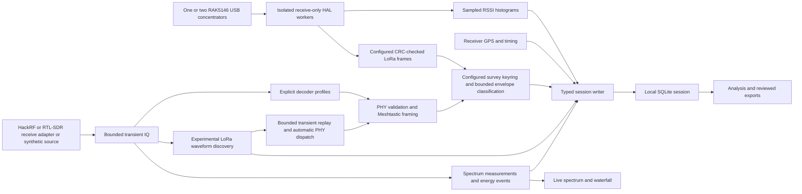

# Architecture

The application is a standalone C++20 receiver, measurement engine, local session store and native desktop interface. Dear ImGui, GLFW and OpenGL provide the UI; SQLite stores sessions; selected SDRangel-derived algorithms, OpenSSL libcrypto and Nanopb support the current LoRa/Meshtastic path. It does not require SDR++, SDRangel, GNU Radio or a mesh companion application at runtime. See [dependencies and licensing](../engineering/dependencies-and-licensing.md).

## Current processing paths

The current desktop hard-disables LoRa discovery, automatic/manual PHY dispatch and packet classification, including RAK packet reception. Remembered preferences and explicit desktop launch settings cannot enable them. Spectrum processing, sampled RAK scans, receiver GPS, recording and reporting remain active. The graph below includes retained experimental backend paths for architecture reference; its LoRa branches are not enabled desktop features. Explicit internal diagnostics remain development tools, not an alternate supported user workflow.

**The retained backend can feed discovered SDR waveforms into a PHY decoder in explicit development diagnostics.** A bounded transient subband history replays detected preambles into receivers at the inferred frequency/BW/SF; subsequent samples continue those receivers. The survey keyring then classifies CRC-valid frames. No default frequency is assumed, and optional manual profiles share the same keyring. The catalog covers all 17 reviewed Meshtastic preset names, including historical/deprecated entries; discovery searches 62.5/125/250/500 kHz at SF7–12 and 15.625 kHz at SF7–10. This disabled desktop path remains unqualified for reliable live traffic identification. Unknown activity still contributes spectrum measurements.

## Component boundaries

| Component | Current responsibility | Important limit |
|---|---|---|
| Receive adapter and engine | Receive-only device access, transient sample ownership, configuration, sample progression and known acquisition gaps | No RF transmission or mesh administration; upstream missing-sample counts may be unknown |
| Spectrum processor | Complete accepted FFT intervals, frequency-resolved powers/activity masks, energy events and live display values | Uncalibrated dBFS; finite resolution and a fixed activity threshold |
| Waveform discovery | Shared channelization and bounded background processing for LoRa preamble/BW/SF observations | Separate queue/processing losses; no exhaustive detection or protocol identity guarantee |
| Automatic and optional profile decoders | Transient replay/channel extraction, synchronization, symbol decoding and PHY checks at inferred or explicitly configured settings | Weak-signal, clock/timing and CRC-performance gaps remain |
| RAK concentrator workers | One isolated process per selected USB board; configured service-modem reception and auxiliary RSSI sweeps | Sampled energy, not IQ or continuous occupancy; one packet profile per board; no automatic channel discovery |
| Protocol and keys | Retained native Meshtastic wire handling, finite explicit survey keyring and bounded envelope-only protobuf parsing | Disabled in the desktop; no private-key defaults, MeshCore decoder, recipient PKI or authenticated sender identity |
| Session writer | Allowlisted typed records, SQLite transactions and versioned recording formats | No opaque undecoded payload or raw-IQ field; session files are plaintext |
| GPS provider | Local device metadata, selected NMEA connection, fix validity and acquisition-time association | Receiver location only; a connection is not a valid fix or a measured accuracy guarantee |
| Desktop and reports | Live status, source-bound analysis, saved-session actions and local exports | Display bounds do not establish complete discovery or transmitter attribution |

## Concurrency and state

Spectrum processing and waveform discovery have separate bounded work paths. The discovery workers process transient complex samples and return bounded observations; they do not directly access SQLite, keys, GPS or UI state. Receiver positions attach using acquisition timing. Queue rejection, abandoned processing and acquisition gaps are recorded separately, so uninterrupted spectrum transport cannot be mistaken for uninterrupted discovery.

The SDR, protocol, storage and UI components share one process. Each optional RAK board instead has a separate HAL worker with bounded local IPC, strict record parsing, deadlines and explicit shutdown. Its process boundary contains HAL global state and failures but is not an operating-system security sandbox. Bounded buffers and checked parsing reduce exposure without guaranteeing isolation from every native-code defect. See [security and privacy](../security/security-and-privacy.md).

Stop/Resume preserves the current survey and appends an acquisition interval with its own receiver configuration. Supported SDR tuning, rate, span, gain and threshold changes apply to the next interval without rewriting earlier measurements. Paused time is unobserved. Switching receiver type, recording destination/detail mode or RAK board/scan/packet setup requires New. Key changes use a stop/drain/clear boundary; there is no asynchronous key-policy service or persistent key vault. Ordinary startup creates a fresh workspace with RF stopped; an enabled recognized or remembered GPS may connect automatically. Demo, historical and managed modes remain isolated from ordinary preferences.

## Persistence and analysis

The session writer selects Compact schema 6 by default or Detailed schema 5. Both retain fine joint activity masks and original GPS associations. Compact storage shares power means/maxima over at most one second and records that wider support. It cannot reconstruct discarded subsecond power history. See [data and retention](data-model-and-retention.md).

RAK sessions use schema 7 with complete RSSI histograms, configured packet profiles, receiver metadata and board health. Their analysis path never invents FFT coverage or busy time from sampled RSSI. See [concentrator measurements](concentrator-measurements.md).

New recordings add validated acquisition tables to these numeric schemas. Each interval preserves its settings and exact frequency grid; readers reject missing or inconsistent provenance. Full-range analysis covers the union of measured ranges, while reports separate acquisition settings. Discovery health checkpoints describe the latest acquisition only; earlier waveform observations remain available without inventing earlier discovery coverage. Save copy preserves the extension. Older readers may reject these files even when they recognize the numeric schema version; historical files remain unchanged.

Analysis and reporting read a consistent SQLite snapshot. Frequency selection combines recorded activity masks using time unions, while location filters use associated receiver fixes. The live frequency summary is available without disk recording; detailed retrospective queries require saved history. UI and CLI use shared query/report logic. CSV, GeoJSON and HTML reports expose scope, coverage and relevant privacy choices. Measurement definitions are in the [spectrum specification](spectrum-measurement-record.md).

Raw IQ, symbols and rejected payloads remain transient in the ordinary application. Inner message contents and identifiers are not interpreted or retained. The classifier returns only status plus optional port/signature-presence evidence; unauthenticated envelope plausibility can produce false positives. Historical reads use the same metadata-only projection. New-policy Save copy reconstructs allowlisted records; pre-policy files cannot be copied by the application. Developer diagnostics are not an ordinary recording feature and do not justify publishing operational captures.

## Future interfaces

Further receiver support, live qualification of automatic waveform-to-packet dispatch, MeshCore and multi-session comparison require their own capability and validation work. Remote/mobile monitoring is later work with no current listener or cloud dependency. Any future interface must preserve host-side key handling, explicit data permissions and separate acquisition/discovery/decoder coverage. See the [roadmap](../product/roadmap.md).

## Automatic decoder capacity

Each discovery subband retains at most 2,097,152 transient complex samples (16 MiB), with a 512 MiB global history budget, four active decoders per subband and 64 queued frame results. Expanded waveform detection has additional bounded storage and processing cost; a wide HackRF configuration can require roughly half a GiB before engine/UI overhead. History misses, decoder limits, timeouts, resets and result overflow are separately counted. These are implementation bounds, not a throughput guarantee. Source/discovery loss never becomes quiet spectrum. Internal diagnostics expose these counters; retained backend sessions and detailed exports can contain per-acquisition aggregate decoder metadata. The desktop does not run this pipeline or expose its controls.

Repetition confidence is calculated from the retained samples only when a measured upchirp updates a candidate; it is metadata, not a detection gate. The differential chirp screen retains the globally selected every-fourth samples used by its existing calculation, with finite-input checks on every sample. Both changes preserve the supported frequency/BW/SF search. Reset erases the ring slots written in the current continuous segment before discarding their bounds, including wrapped histories and implicit input gaps. Unwritten storage starts and remains zero. These reductions in work do not justify hiding capacity losses or increasing the advertised usable span.

In the retained diagnostic path, three detector workers share three bounded job queues. An idle worker scans queued jobs for an eligible subband, skipping bands that already have an active owner; it is not restricted to a blocked queue front. Earlier jobs for the same band remain ordered, including resets. Active jobs occupy their original slots until processing and erasure finish: the bound remains 48 jobs total, with no hidden per-worker IQ copy. Queue high-water measurements include pending and active slots. Expensive DSP runs outside the scheduler mutex. This distributes work when nearby or periodically spaced busy frequencies would otherwise load one worker disproportionately; sustained aggregate overload still produces explicit gaps. Desktop spectrum-only acquisition does not start this pipeline.
