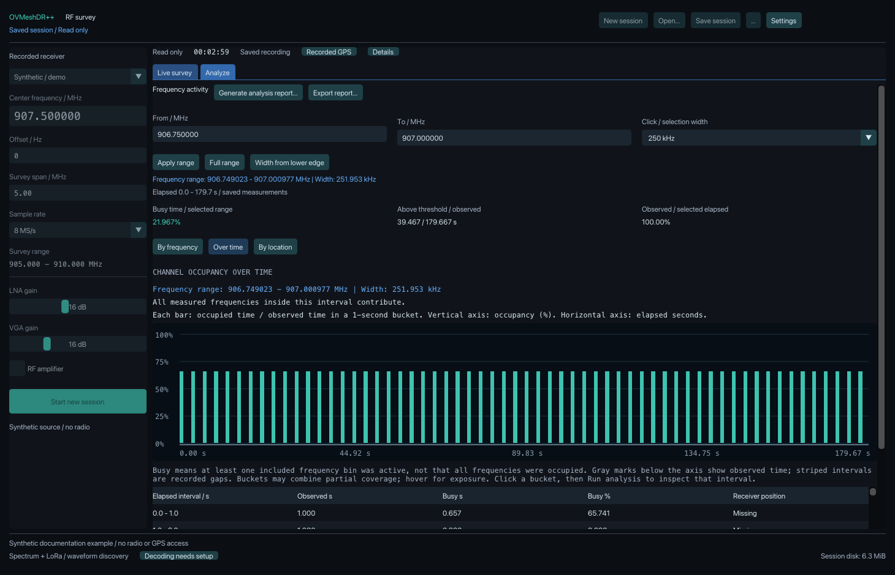
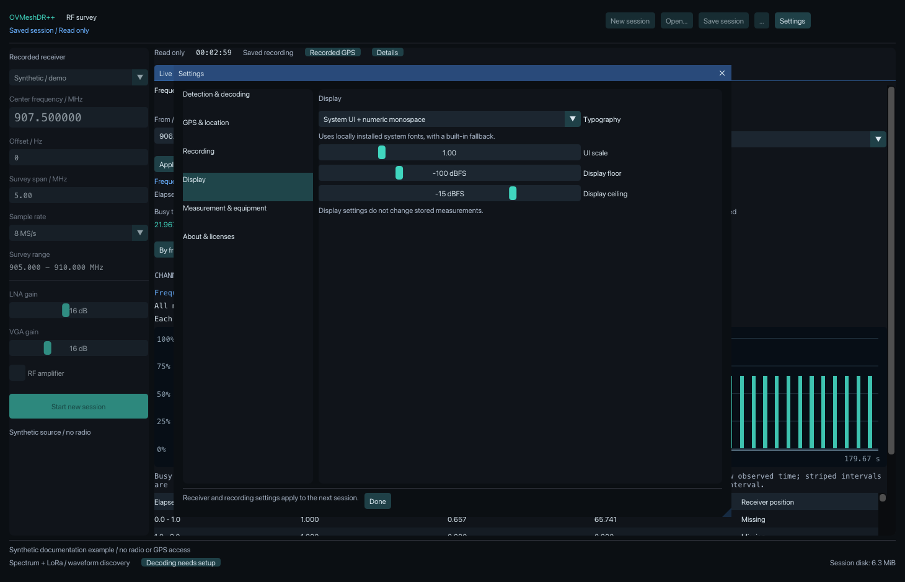

# Application screenshots

Existing images predate semantic-content removal. They are historical illustrations; current labels and controls may differ. No screenshots were regenerated for this change.

All five screenshots show the actual macOS application or its generated HTML report using synthetic RF input. They contain no operational GPS fixes, decoded messages, keys, device serials or personal file paths. Synthetic examples demonstrate the interface and report format; they do not establish RF accuracy or decoder performance.

## Live spectrum and detected waveforms


The 905–910 MHz demo shows repeated synthetic LoRa waveforms and a separate narrow signal. The table displays the observation's full UTC timestamp, center, inferred bandwidth and spreading factor. Inferred 250 kHz / SF11 is waveform evidence; it does not authenticate a transmitter or identify Meshtastic. The bottom-right session-size indicator includes the database and SQLite sidecars. This screenshot was taken while the synthetic source was running, with no USB receiver or GPS connection.

## Frequency activity


The same saved demo is opened read-only. Selecting 906.750–907.000 MHz includes the intersecting recorded bin edges, so the displayed measured width is about 251.953 kHz. The highlighted interval drives the selected-range metrics. The chart itself is the full-session per-frequency overview; its low-activity scale is logarithmic. Busy time means at least one selected bin exceeded the recorded threshold, not that the entire selection was occupied simultaneously.

## Activity over time



The same interval shows about 21.967% busy time across the recorded observation. The bars show each time bucket's occupancy, rather than packet counts or a device's transmitted airtime. Regular spacing comes from the deterministic demo. No receiver positions were recorded; missing positions remain explicit.

## Settings



Receiver controls remain on the main workspace. Detection, GPS, recording, display, measurement/equipment and licenses have separate Settings pages. Display floor/ceiling and typography affect presentation, not stored RF measurements. The developer renderer is passive, so session-changing controls in these saved-session examples are disabled.

## Generated analysis report


This is the opening section of the actual HTML report generated from that saved demo and frequency selection. The complete report contains seven sections covering observations, frequency activity, time variation, geographic coverage, waveform/protocol evidence, measurement setup and limitations. Message content is excluded; geographic/provenance fields require their own opt-ins. This example has no positions. The report's measured exposure denominator uses the session's selected elapsed span; the UI's resolved measured interval can differ slightly at acquisition boundaries. Both report the same busy and observed seconds here. See the [user guide](../user-guide.md#generate-a-readable-survey-analysis) for use and the [gap analysis](../engineering/rf-survey-gap-analysis.md) for current limits.

## Reproducing and reviewing synthetic documentation images

The live image came from a running native synthetic demo. The other three desktop views use [the developer documentation renderer](../../tests/diagnostics/docs_screenshots.cpp), which invokes the actual UI with a saved synthetic survey and explicit view selection. It does not simulate button clicks, load ordinary preferences, connect to GPS or start a receiver. It is an explicit build target, excluded from default builds and CTest, and is not installed with the product.

After building the desktop dependencies, build `docs-screenshots` and run it with an absolute path to a reviewed synthetic survey and a **new** output directory:

```sh
cmake --build build/native --target docs-screenshots --parallel 2
build/native/docs-screenshots /absolute/local/synthetic-survey.sqlite /absolute/local/new-screenshot-directory
```

It writes three PNGs and a standalone HTML report. Render that local HTML in a browser for the report preview; it requires no external resources. Review image pixels and metadata before publishing and keep screenshot inputs synthetic. A synthetic flag alone does not guarantee that paths, identifiers or unrelated screen content are absent.

These examples do not establish RF calibration, decoder coverage, moving-GPS accuracy, cross-platform behavior or FCC compliance.
